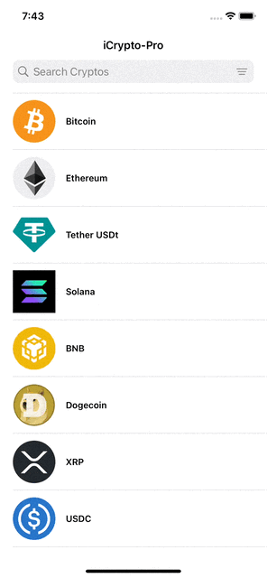

# iCrypto-pro 📈

iCrypto-pro is an iOS application that allows users to search and view cryptocurrency information using the CoinMarketCap API. The app provides users with real-time data, including current prices, market cap, and other essential metrics for various cryptocurrencies.


## App Demo


## Table of Contents
- [Features](#features)
- [Installation](#installation)
- [Requirements](#requirements)
- [Architecture](#architecture)
- [API](#api)
- [Usage](#usage)

## Features
- **Cryptocurrency Search**: Quickly search for your favorite cryptocurrencies.
- **Real-Time Data**: View live information such as current price, market cap, and volume.
- **Clean UI**: Designed using UIKit and view code for a seamless experience.
- **MVVM Architecture**: Clean and maintainable code architecture.
- **API Integration**: Pulls real-time data from the CoinMarketCap API.

## Installation
1. Clone the repository:
   ```bash
   git clone https://github.com/felipeassis97/iCrypto-pro.git
   cd iCrypto-pro
   ```
2.	Install dependencies:
	  •	Make sure you have CocoaPods installed, then run:
     ```bash
     pod install
     ```
3.	Add your CoinMarketCap API key:
	  •	Set up environment configurations as described below, then add your API key to Debug.xcconfig and Release.xcconfig.

## Requirements
- **iOS 15.0+**
- **Xcode 14.0+**
- **Swift 5.0+**

## Architecture
- iCrypto-pro follows the Model-View-ViewModel (MVVM) architecture pattern to keep the code clean, maintainable, and testable. The app is built with UIKit and uses view code for creating user interfaces programmatically, without Storyboards.
- Project Structure
  -	**Model:** Defines the data structures for handling cryptocurrency data.
  -	**View:** Custom views and UI elements built using UIKit and view code.
  -	**ViewModel:** Connects the View and Model, handling data transformations and API calls.

## API

- This app integrates with the CoinMarketCap API to fetch real-time cryptocurrency data. To use the API, sign up for a CoinMarketCap developer account and generate an API key.

- Environment Configuration

  - API keys and other secrets are stored in environment-specific .xcconfig files for added security. The keys can be accessed in the app by using the Constants struct:
    ```swift
    struct Constants {
        static let API_KEY = Bundle.main.object(forInfoDictionaryKey: "API_KEY") as? String ?? ""
    }
    ```
## Usage
1.	Launch the app, and you’ll be greeted with a search bar.
2.	Enter the name or symbol of a cryptocurrency to view details.
3.	Scroll through the list to explore other popular coins and their market information.
